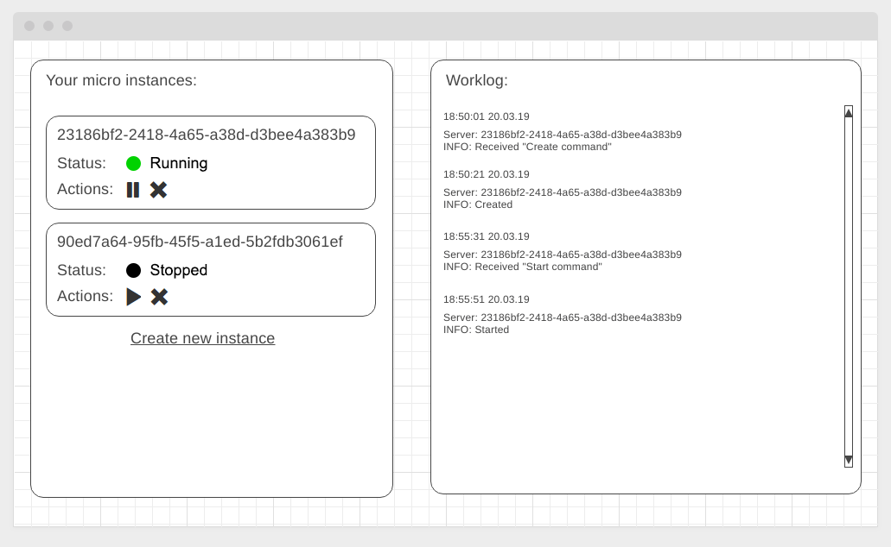

#### Deployment:  <a href="">Github Pages</a>

#### Backend:  <a href="https://github.com/Sergius92739/ahj-8.2-sse-ws_backend">Repository</a>

#### Server:  <a href="https://ahj-8-2-sse-ws-sergius.herokuapp.com/">Heroku</a>

---

## Cloud Dashboard

### Легенда

В рамках реализации интерфейса для системы управления облачными серверами необходимо организовать для оператора рабочее место, позволяющиее создавать, запускать, останавливать и удалять облачные сервера.

### Описание

Общий вид рабочего места:



#### Серверная часть

Вам необходимо самостоятельно провести анализ и выбрать технологию для реализации серверной части: REST, SSE, WS, либо их комбинации. Внимательно взвесьте плюсы и минусы каждой технологии при выборе! Поскольку выбор неправильной технологии может обернуться сложностями в реализации и потерями времени.

Информация о конкретном инстансе должна быть представлена в следующем виде:
```json
{
  "id": "<uuid>",
  "state": "running | stopped"
}
```
Где `<id>` - автоматически генерируется на сервере, при создании статус - `stopped`.

Должна быть возможность:
* Создания инстанса (id генерируется автоматически)
* Удаление инстанса по ID
* Изменение состояния (с `running` на `stopped` и со `stopped` на `running`)

Обратите внимание, создание, старт, остановка и удаление инстансов виртуальной машины - это ресурсоёмкая операция, поэтому на все запросы кроме получения списка инстансов, вы отдаёте "пустой" ответ (например, `{"status": "ok"}` для REST API) и устанавливаете `setTimeout` на 20 секунд для выполнения операции, например псевдо-код для REST API:

```javascript
const instances = [];

router.post('/instances', async (ctx) => {
  // Каким-то образом, должны сообщить клиенту о том, что получена команда "Create command""
  const id = <generate id>;
  <write client notification code here>

  setTimeout(() => { // <- создаём инстанс только через 20 секунд
    instances.push({
      id,
      state: 'stopped',
    });

    // Каким-то образом должны сообщить клиенту о том, что команда выполнена, сервер создан
    <write client notification code here>

  }, 20000);

  ctx.response.body = {
    status: 'ok'
  }
});
```

#### Клиентская часть

Клиентская часть должна работать следующим образом:
1. При загрузке страницы загружается список инстансов и отрисовывается в виджете управления инстансами (слева)
1. Выполняется подключение по нужному протоколу с началом отслеживания событий. Мы предлагаем вам для разделения событий использовать следующие "ключи":
* `received` - сервером получена команда
* `created` - создан новый инстанс
* `started` - инстанс запущен
* `stopped` - инстанс остановлен
* `removed` - инстанс удалён

Виджет управления инстансами (слева) работает следующим образом:
1. Status - отображает текущий статус
1. Actions - кнопки управления состояниями (зависят от текущего статуса) позволяют отправить команду на запуск, остановку или удаление инстанса
1. Create new instance - позволяет отправить команду на создание нового инстанса.

Обратите внимание, в виджете управления состояние должно быть синхронизировано с текущим состоянием на сервере. Т.е. если вы получаете информацию с сервера о том, что инстанс стартовал, то это должно быть отображено как в Worklog'е, так и в виджете управления инстансами.

**Advanced** (необязательная часть): попробуйте реализовать виджет управления инстансами и виджет Worklog в виде отдельных виджетов, не связанных друг с другом и синхронизируйте состояние через State Management.
